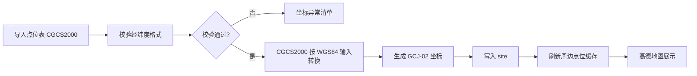
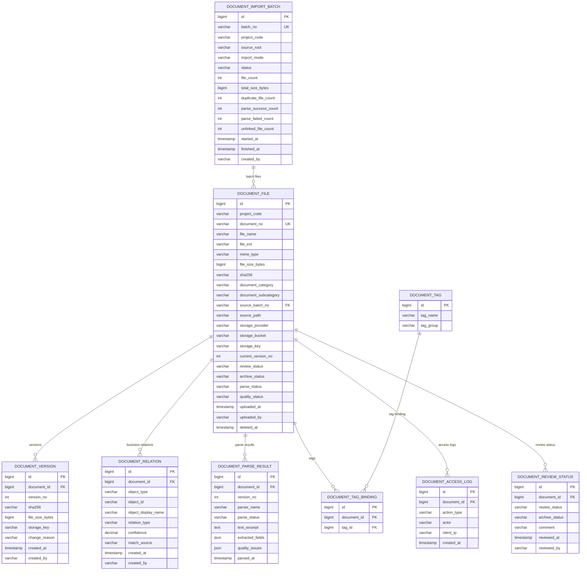

# 数据库 ER 设计：无锡车路云项目管理平台一期

## 1. 设计目标

一期数据库设计围绕点位、设备安装位置、未匹配设备治理、地图坐标、周边点位、一点一档和资料附件展开。

核心原则：

- `NodeID` 是点位业务主键。
- 行政区域按项目最新口径管理，经开区并入新吴区，同时保留原始行政区域。
- 点位原始坐标 CGCS2000 必须保留。
- 高德地图展示使用 GCJ-02 坐标。
- 设备安装位置以 `NodeID + 安装位置 + 物料` 关联点位。
- 未匹配设备进入治理池，不直接污染点位设备统计。
- 一路一档/一点一档资料按路口目录自动归集，验收单、接线表和照片需解析成结构化数据。
- 合同管理按宏观合同流骨架、Word 合同边界、前后向多对多候选关系和设备级资金流单元建模，支持业主审计与阶段付款释放。

## 2. ER 总览

```mermaid
erDiagram
    SITE ||--o{ DEVICE_INSTALLATION_ITEM : "NodeID/site_id"
    SITE ||--o{ SITE_NEIGHBOR_CACHE : "current site"
    SITE ||--o{ DOCUMENT_FILE : "archive files"
    SITE ||--o{ SITE_ARCHIVE_FOLDER : "archive folder"
    SITE_ARCHIVE_FOLDER ||--o| SITE_ACCEPTANCE_FORM : "acceptance docx"
    SITE_ACCEPTANCE_FORM ||--o{ SITE_ACCEPTANCE_DEVICE_ITEM : "device check"
    SITE_ACCEPTANCE_FORM ||--o{ SITE_ACCEPTANCE_TEST_ITEM : "function test"
    SITE_ARCHIVE_FOLDER ||--o| SIGNAL_WIRING_FORM : "wiring xls"
    SIGNAL_WIRING_FORM ||--o{ SIGNAL_WIRING_ITEM : "wiring item"
    SITE_ARCHIVE_FOLDER ||--o{ SITE_ARCHIVE_PHOTO : "photos"
    DEVICE_INSTALLATION_ITEM ||--o{ DOCUMENT_FILE : "device files"
    DEVICE_INSTALLATION_ITEM ||--o| DEVICE_UNMATCHED_ITEM : "unmatched governance"
    SITE ||--o{ WORK_ORDER : "maintenance"
    SITE ||--o{ RECTIFICATION_ISSUE : "construction issue"
    CONTRACT_PARTY ||--o{ CONTRACT_FLOW_NODE : "party nodes"
    CONTRACT_FLOW_LINE ||--o{ CONTRACT_FLOW_NODE : "flow nodes"
    CONTRACT_FLOW_LINE ||--o{ CONTRACT_FLOW_EDGE : "flow edges"
    CONTRACT_PACKAGE ||--o{ CONTRACT_ITEM : "quote items"
    CONTRACT_ITEM ||--o{ CONTRACT_ITEM_CONTRACT_ROLE : "party roles"
    CONTRACT_ITEM ||--o{ CONTRACT_ITEM_DEVICE_MATCH : "device match"
    CONTRACT_ITEM ||--o{ CONTRACT_ITEM_FULFILLMENT_EVENT : "device events"
    CONTRACT_ITEM ||--o{ CONTRACT_ITEM_CASH_FLOW : "item cash flow"
    DEVICE_INSTALLATION_ITEM ||--o{ CONTRACT_ITEM_DEVICE_MATCH : "contract match"
    DEVICE_INSTALLATION_ITEM ||--o{ CONTRACT_ITEM_FULFILLMENT_EVENT : "events"
    DEVICE_INSTALLATION_ITEM ||--o{ CONTRACT_ITEM_CASH_FLOW : "cash flow"
    CONTRACT ||--o{ CONTRACT_PAYMENT_NODE : "payments"
    CONTRACT ||--o{ CONTRACT_DOCUMENT_PARSE : "contract docs"
    CONTRACT_FLOW_LINE ||--o{ CONTRACT : "related contracts"
    CONTRACT ||--o{ CONTRACT_ITEM_CONTRACT_ROLE : "front/back role"

    SITE {
        bigint id PK
        varchar node_id UK
        varchar cross_id
        varchar site_name
        varchar site_type
        varchar district
        varchar original_district
        decimal longitude_cgcs2000
        decimal latitude_cgcs2000
        decimal longitude_gcj02
        decimal latitude_gcj02
        varchar coordinate_convert_status
        varchar site_status
    }

    DEVICE_INSTALLATION_ITEM {
        bigint id PK
        varchar node_id FK
        bigint site_id FK
        varchar install_position
        varchar supplier_name
        varchar material_code
        varchar material_name
        varchar contract_name
        decimal inbound_quantity
        decimal requisition_quantity
        decimal installed_quantity
        varchar match_status
    }

    DEVICE_UNMATCHED_ITEM {
        bigint id PK
        bigint source_item_id FK
        varchar governance_status
        varchar target_type
        bigint target_id
        varchar target_node_id
    }

    SITE_NEIGHBOR_CACHE {
        bigint id PK
        bigint site_id FK
        bigint neighbor_site_id FK
        decimal distance_meters
        int rank_no
    }

    SITE_ARCHIVE_FOLDER {
        bigint id PK
        bigint site_id FK
        varchar archive_name
        varchar folder_path
        varchar match_status
        decimal archive_completeness
    }

    SITE_ACCEPTANCE_FORM {
        bigint id PK
        bigint archive_folder_id FK
        bigint site_id FK
        varchar intersection_name
        varchar intersection_code
        varchar administrative_division
        varchar management_department
        decimal acceptance_longitude
        decimal acceptance_latitude
        varchar intersection_type
    }

    SITE_ACCEPTANCE_DEVICE_ITEM {
        bigint id PK
        bigint acceptance_form_id FK
        varchar category
        varchar device_name_model
        decimal quantity
        varchar check_result
    }

    SITE_ACCEPTANCE_TEST_ITEM {
        bigint id PK
        bigint acceptance_form_id FK
        varchar check_item
        varchar standard_requirement
        varchar check_result
    }

    SIGNAL_WIRING_FORM {
        bigint id PK
        bigint archive_folder_id FK
        bigint site_id FK
        varchar intersection_name
        varchar jurisdiction
        varchar construction_unit
        varchar signal_controller_brand
    }

    SIGNAL_WIRING_ITEM {
        bigint id PK
        bigint wiring_form_id FK
        int sequence_no
        varchar signal_position
        varchar signal_light_type
        decimal quantity
        varchar wiring_position
    }

    SITE_ARCHIVE_PHOTO {
        bigint id PK
        bigint archive_folder_id FK
        bigint site_id FK
        bigint file_id FK
        varchar photo_type
        boolean is_cover
    }

    DOCUMENT_FILE {
        bigint id PK
        varchar object_type
        bigint object_id
        varchar file_name
        varchar file_category
        varchar storage_path
    }

    WORK_ORDER {
        bigint id PK
        bigint site_id FK
        varchar node_id
        varchar status
    }

    RECTIFICATION_ISSUE {
        bigint id PK
        bigint site_id FK
        varchar status
    }

    CONTRACT_PARTY {
        bigint id PK
        varchar party_name
        varchar standard_party_name
        varchar party_type
        boolean is_consortium_member
    }

    CONTRACT_FLOW_LINE {
        bigint id PK
        varchar item_no
        varchar project_item_name
        decimal bid_amount
        varchar split_package_name
        decimal split_package_amount
        varchar flow_path_text
        varchar flow_type
    }

    CONTRACT_FLOW_NODE {
        bigint id PK
        bigint flow_line_id FK
        bigint party_id FK
        int level_no
        decimal level_amount
    }

    CONTRACT_FLOW_EDGE {
        bigint id PK
        bigint flow_line_id FK
        bigint from_party_id FK
        bigint to_party_id FK
        decimal upstream_amount
        decimal downstream_amount
        decimal edge_profit_amount
    }

    CONTRACT_PACKAGE {
        bigint id PK
        varchar package_no
        varchar package_name
        varchar package_category
        decimal subtotal_amount
        decimal original_factory_amount
        decimal gross_profit_amount
    }

    CONTRACT_ITEM {
        bigint id PK
        bigint package_id FK
        varchar item_type
        varchar item_name
        varchar brand_model
        decimal quantity
        decimal unit_price
        decimal amount
        varchar flow_package_name
        bigint front_contract_id FK
        bigint back_contract_id FK
        boolean owner_backflow_required
    }

    CONTRACT_ITEM_CONTRACT_ROLE {
        bigint id PK
        bigint contract_item_id FK
        varchar role_type
        bigint contract_id FK
        bigint party_id FK
        decimal allocated_amount
    }

    CONTRACT_ITEM_DEVICE_MATCH {
        bigint id PK
        bigint contract_item_id FK
        bigint device_installation_item_id FK
        bigint site_id FK
        decimal matched_quantity
        varchar match_status
    }

    CONTRACT {
        bigint id PK
        varchar contract_no
        varchar contract_name
        varchar contract_type
        bigint upstream_party_id FK
        bigint downstream_party_id FK
        decimal contract_amount
        varchar contract_status
    }

    CONTRACT_PAYMENT_NODE {
        bigint id PK
        bigint contract_id FK
        varchar node_name
        varchar trigger_type
        decimal planned_amount
        boolean upstream_receipt_required
        varchar payment_status
    }

    CONTRACT_DOCUMENT_PARSE {
        bigint id PK
        bigint contract_id FK
        varchar contract_direction
        varchar file_name
        varchar ocr_status
        varchar parsed_party_a
        varchar parsed_party_b
        decimal parsed_amount
    }

    CONTRACT_ITEM_FULFILLMENT_EVENT {
        bigint id PK
        bigint contract_item_id FK
        bigint device_installation_item_id FK
        varchar event_type
        varchar event_status
        datetime actual_time
        decimal event_quantity
    }

    CONTRACT_ITEM_CASH_FLOW {
        bigint id PK
        bigint contract_item_id FK
        bigint device_installation_item_id FK
        bigint contract_id FK
        varchar cash_flow_direction
        decimal planned_amount
        decimal actual_amount
        bigint upstream_cash_flow_id FK
        varchar cash_flow_status
    }
```



## 3. 表设计

### 3.1 点位表 `site`

用途：存储点位管理表导入后的标准点位数据。

主键：

- `id`

唯一键：

- `node_id`

关键字段：

- `serial_no`
- `site_type`
- `district`
- `original_district`
- `district_normalize_rule`
- `node_id`
- `cross_id`
- `node_name_en`
- `site_name`
- `signal_vendor`
- `perception_site_type`
- `is_adaptive_intersection`
- `is_variable_lane_site`
- `in_current_signal_scope`（原始导入审计字段，不用于页面默认筛选）
- `variable_lane_count`
- `variable_lane_direction`
- `longitude_cgcs2000`
- `latitude_cgcs2000`
- `longitude_gcj02`
- `latitude_gcj02`
- `coordinate_convert_method`
- `coordinate_convert_status`
- `coordinate_convert_time`
- `site_status`
- `created_at`
- `updated_at`

索引建议：

- `idx_site_node_id`
- `idx_site_district`
- `idx_site_type`
- `idx_site_name`
- `idx_site_gcj02`
- `idx_site_coordinate_status`

### 3.2 设备安装位置表 `device_installation_item`

用途：存储设备安装位置表中的设备、物料、合同、单据和数量信息。

主键：

- `id`

外键：

- `site_id` 关联 `site.id`

关键字段：

- `node_id`
- `site_id`
- `site_name`
- `install_position`
- `supplier_name`
- `material_code`
- `material_name`
- `contract_name`
- `brand_model`
- `unit`
- `contract_quantity`
- `delivered_quantity`
- `delivery_order_index`
- `delivery_order_date`
- `inbound_quantity`
- `inbound_order_index`
- `inbound_order_date`
- `unpacking_quantity`
- `unpacking_order_index`
- `unpacking_issue`
- `unpacking_order_date`
- `requisition_quantity`
- `requisition_order_date`
- `requisition_order_index`
- `installed_quantity`
- `warehouse_quantity`
- `contract_unit_price`
- `contract_total_price`
- `is_online`
- `is_statistics_completed`
- `in_hardware_statistics_scope`
- `match_status`
- `data_source_sheet`
- `created_at`
- `updated_at`

索引建议：

- `idx_device_item_node_id`
- `idx_device_item_site_id`
- `idx_device_item_material_code`
- `idx_device_item_material_name`
- `idx_device_item_supplier`
- `idx_device_item_contract`
- `idx_device_item_match_status`
- `idx_device_item_unp_issue`

### 3.3 未匹配设备治理表 `device_unmatched_item`

用途：管理设备安装位置表中 `未匹配` 工作表或 Sheet1 匹配失败的数据。

主键：

- `id`

外键：

- `source_item_id` 关联 `device_installation_item.id`

关键字段：

- `source_item_id`
- `governance_status`
- `target_type`
- `target_id`
- `target_node_id`
- `governance_remark`
- `governed_by`
- `governed_at`
- `created_at`
- `updated_at`

治理状态：

- 待治理
- 已关联点位
- 已关联机房
- 已关联仓库
- 车端设备
- 软件服务项
- 已忽略

索引建议：

- `idx_unmatched_status`
- `idx_unmatched_target_type`
- `idx_unmatched_target_node_id`

### 3.4 周边点位缓存表 `site_neighbor_cache`

用途：缓存每个点位最近 4-5 个周边点位，提升点位编辑页地图加载速度。

本表为系统自动计算表，不允许人工编辑。

主键：

- `id`

外键：

- `site_id` 关联 `site.id`
- `neighbor_site_id` 关联 `site.id`

关键字段：

- `site_id`
- `neighbor_site_id`
- `distance_meters`
- `rank_no`
- `calculated_at`

唯一键：

- `site_id + neighbor_site_id`

索引建议：

- `idx_neighbor_site_rank`
- `idx_neighbor_neighbor_site`

计算规则：

1. 以 `longitude_gcj02`、`latitude_gcj02` 计算距离。
2. 排除当前点位。
3. 默认缓存最近 5 个点位。
4. 点位坐标发生变化后重新计算当前点位及受影响周边点位。

### 3.5 一路一档目录表 `site_archive_folder`

用途：记录从一路一档资料目录自动扫描出的路口档案文件夹。

关键字段：

- `id`
- `site_id`
- `node_id`
- `archive_name`
- `folder_path`
- `matched_site_name`
- `match_status`
- `match_score`
- `archive_completeness`
- `missing_items`
- `imported_at`
- `updated_at`

### 3.6 验收单表 `site_acceptance_form`

用途：结构化保存 `验收单.docx` 解析结果。

关键字段：

- `id`
- `archive_folder_id`
- `site_id`
- `file_id`
- `intersection_name`
- `intersection_code`
- `administrative_division`
- `management_department`
- `acceptance_longitude`
- `acceptance_latitude`
- `intersection_type`
- `construction_unit`
- `contact_phone`
- `east_road_name`
- `west_road_name`
- `south_road_name`
- `north_road_name`
- `parse_status`
- `parsed_at`

### 3.7 验收设备明细表 `site_acceptance_device_item`

用途：保存验收单中的设备验收明细。

关键字段：

- `id`
- `acceptance_form_id`
- `category`
- `device_name_model`
- `quantity`
- `check_result`
- `issue_description`

### 3.8 验收功能测试表 `site_acceptance_test_item`

用途：保存验收单中的功能测试结果。

关键字段：

- `id`
- `acceptance_form_id`
- `test_category`
- `check_item`
- `standard_requirement`
- `check_result`
- `issue_description`

### 3.9 信号机接线表 `signal_wiring_form`

用途：结构化保存 `接线表.xls` 的表头信息。

关键字段：

- `id`
- `archive_folder_id`
- `site_id`
- `file_id`
- `intersection_name`
- `jurisdiction`
- `construction_unit`
- `signal_controller_brand`
- `sheet_name`
- `parse_status`
- `parsed_at`

### 3.10 信号机接线明细表 `signal_wiring_item`

用途：保存接线表中的信号灯类别、数量、接线位置和端子号。

关键字段：

- `id`
- `wiring_form_id`
- `sequence_no`
- `signal_position`
- `signal_light_type`
- `quantity`
- `wiring_position`
- `terminal_no_1`
- `terminal_no_2`
- `terminal_no_3`
- `remark`

### 3.11 点位照片表 `site_archive_photo`

用途：保存一路一档目录中的点位照片结构化信息。

关键字段：

- `id`
- `archive_folder_id`
- `site_id`
- `file_id`
- `photo_type`
- `shooting_direction`
- `is_cover`

### 3.12 资料文件表 `document_file`

用途：管理点位、设备、合同、工单等对象的附件资料。

主键：

- `id`

关键字段：

- `match_score`
- `file_type`
- `file_category`
- `object_type`
- `object_id`
- `object_code`
- `storage_path`
- `version_no`
- `uploaded_by`
- `uploaded_at`
- `remark`

索引建议：

- `idx_document_object`
- `idx_document_category`
- `idx_document_object_code`

### 3.13 工单表 `work_order`

用途：记录点位运维工单。

一期与点位相关的关键字段：

- `id`
- `work_order_no`
- `site_id`
- `node_id`
- `title`
- `fault_level`
- `status`
- `handler_id`
- `created_at`
- `closed_at`

### 3.14 整改问题表 `rectification_issue`

用途：记录施工、监理、验收过程发现的问题。

一期与点位相关的关键字段：

- `id`
- `issue_no`
- `site_id`
- `node_id`
- `title`
- `responsible_unit`
- `status`
- `deadline`
- `created_at`
- `closed_at`

### 3.15 合同主体表 `contract_party`

用途：统一管理移动、天安、浪潮、大为、上研、工业安装等合同流节点单位。支持主体名称归一，例如尚行、上海帆一尚行、帆一统一为上汽帆一。

关键字段：

- `id`
- `party_name`
- `standard_party_name`
- `original_party_name`
- `party_short_name`
- `party_type`
- `is_consortium_member`
- `alias_names`
- `contact_person`
- `contact_phone`

### 3.16 合同流原始行表 `contract_flow_line`

用途：保存 `合同流` sheet 每一行原始业务数据。

关键字段：

- `id`
- `source_row_no`
- `item_no`
- `project_item_name`
- `item_subtotal_amount`
- `bid_amount`
- `split_package_name`
- `split_package_amount`
- `supplier_level_1` 至 `supplier_level_6`
- `supplier_level_1_amount` 至 `supplier_level_6_amount`
- `original_factory_amount`
- `gross_profit_amount`
- `discount_rate`
- `primary_supplier`
- `item_pool_sheet_name`
- `flow_path_text`
- `flow_type`

### 3.17 合同流节点表 `contract_flow_node`

用途：将宏观合同流记录拆成多级单位节点，支持链路筛选和证据复核。

关键字段：

- `id`
- `flow_line_id`
- `party_id`
- `party_name`
- `level_no`
- `level_amount`
- `is_tianan_node`
- `is_mobile_node`

### 3.18 合同流边表 `contract_flow_edge`

用途：将合同流节点两两拆成上游到下游的流转边。

关键字段：

- `id`
- `flow_line_id`
- `from_party_id`
- `to_party_id`
- `from_party_name`
- `to_party_name`
- `edge_level`
- `upstream_amount`
- `downstream_amount`
- `edge_profit_amount`
- `edge_type`

### 3.19 分项包表 `contract_package`

用途：保存 `分项报价汇总表` 中 1.1、1.2、1.8 等分项包。

关键字段：

- `id`
- `package_no`
- `package_name`
- `package_category`
- `subtotal_amount`
- `total_amount`
- `original_factory_amount`
- `gross_profit_amount`
- `discount_rate`
- `primary_supplier`
- `item_pool_sheet_name`
- `can_link_site`
- `can_link_device`

### 3.20 合同明细表 `contract_item`

用途：统一保存各清单工作表 中的硬件、软件、服务、施工和资源明细。

关键字段：

- `id`
- `package_id`
- `item_pool_sheet_name`
- `source_row_no`
- `item_no`
- `item_type`
- `item_name`
- `performance_params`
- `brand_model`
- `deployment_location`
- `subsystem_name`
- `module_level_1`
- `module_level_2`
- `workload_person_month`
- `unit`
- `quantity`
- `unit_price`
- `amount`
- `tax_rate`
- `flow_package_name`
- `original_factory_unit_price`
- `original_factory_amount`
- `gross_profit_amount`
- `review_status`
- `document_file_id`
- `front_contract_id`
- `back_contract_id`
- `original_supplier_party_id`
- `owner_backflow_required`
- `match_status`

### 3.21 合同明细主体角色表 `contract_item_contract_role`

用途：解决同一分项 sheet 内不同设备分属不同前向、后向合同主体的问题。合同主体归属必须落到合同明细行级，不能仅按 sheet 级继承。

关键字段：

- `id`
- `contract_item_id`
- `role_type`
- `contract_document_id`
- `party_id`
- `party_name`
- `source_basis`
- `allocation_method`
- `allocated_quantity`
- `allocated_amount`
- `confidence_score`
- `confirmed_by`
- `confirmed_at`

### 3.22 合同明细与设备安装项匹配表 `contract_item_device_match`

用途：建立合同明细与点位设备安装项的设备级关系。

关键字段：

- `id`
- `contract_item_id`
- `device_installation_item_id`
- `site_id`
- `node_id`
- `match_method`
- `match_score`
- `match_basis`
- `matched_quantity`
- `match_status`
- `confirmed_by`
- `confirmed_at`

### 3.23 合同文本边界表 `contract_document`

用途：管理 Word 前向销售合同和后向采购合同解析后的合同边界。合同边界来自合同文本，不来自清单工作表。

关键字段：

- `id`
- `contract_no`
- `contract_name`
- `direction`
- `party_a_id`
- `party_b_id`
- `amount_tax_included`
- `tax_rate`
- `sign_date`
- `payment_terms_text`
- `acceptance_terms_text`
- `back_to_back_likely`
- `parse_status`
- `review_status`
- `document_file_id`

### 3.24 合同与宏观流匹配表 `contract_macro_flow_match`

用途：记录 Word 合同文本与宏观合同流骨架之间的候选匹配证据。该匹配只用于筛选和复核，不直接进入资金计算。

关键字段：

- `id`
- `contract_document_id`
- `macro_flow_id`
- `match_score`
- `confidence`
- `evidence_summary`
- `review_status`
- `review_comment`
- `confirmed_by`
- `confirmed_at`
- `created_at`
- `updated_at`

### 3.25 前后向合同候选关系表 `front_back_contract_candidate`

用途：管理“前向合同 → 天安 → 后向合同”的多对多候选关系。候选关系必须人工确认后，才能生成设备级资金流单元；未确认时 `financial_use_allowed=false`。

关键字段：

- `id`
- `front_contract_id`
- `back_contract_id`
- `shared_macro_flow_ids`
- `party_overlap`
- `keyword_overlap`
- `tax_rate_overlap`
- `score`
- `confidence`
- `decision_status`
- `financial_use_allowed`
- `decision_comment`
- `decided_by`
- `decided_at`

### 3.26 设备级资金流单元表 `contract_device_cashflow_unit`

用途：表示某一设备/软件/服务项在前向合同和后向合同之间的最小资金流核算单元。上游回款、下游付款、毛利、税率和审计均在该单元上计算。

关键字段：

- `id`
- `candidate_id`
- `macro_flow_id`
- `front_contract_id`
- `back_contract_id`
- `front_item_pool_row_id`
- `back_item_pool_row_id`
- `device_installation_item_id`
- `node_id`
- `site_name`
- `item_name`
- `brand_model`
- `quantity`
- `front_amount_tax_included`
- `front_tax_rate`
- `back_amount_tax_included`
- `back_tax_rate`
- `tax_rate_match_status`
- `gross_margin_amount`
- `owner_audit_confirmed_quantity`
- `owner_audit_confirmed_amount`
- `receivable_released_amount`
- `payable_released_amount`
- `overpayment_risk_status`
- `block_reason`

### 3.27 设备级履约事件表 `contract_item_fulfillment_event`

用途：记录同一合同中不同设备或明细的节点发生时间。比如同一后向采购合同内，一部分设备先到货入库，另一部分后安装验收，必须分别记录。

关键字段：

- `id`
- `contract_item_id`
- `device_installation_item_id`
- `site_id`
- `node_id`
- `event_type`
- `event_status`
- `planned_time`
- `actual_time`
- `event_quantity`
- `evidence_object_type`
- `evidence_object_id`
- `remark`

### 3.28 业主设备级审计结果表 `contract_owner_audit_result`

用途：记录业主对设备级数量和金额的审计确认结果。上游可回款金额和下游可付款金额均受该结果约束。

关键字段：

- `id`
- `cashflow_unit_id`
- `node_id`
- `site_name`
- `audit_stage`
- `submitted_quantity`
- `confirmed_quantity`
- `submitted_amount`
- `confirmed_amount`
- `deducted_amount`
- `audit_status`
- `evidence_document_id`
- `remark`

### 3.29 设备级阶段付款表 `contract_device_payment_stage`

用途：按预付款、到货、安装、验收、审计、质保等阶段管理设备级前向可回款和后向可付款释放。前向阶段和后向阶段不要求机械一一对应。

关键字段：

- `id`
- `cashflow_unit_id`
- `stage_code`
- `stage_name`
- `stage_order`
- `trigger_condition`
- `requires_owner_audit`
- `requires_upstream_receipt`
- `stage_ratio`
- `stage_base_amount`
- `front_stage_receivable_amount`
- `front_stage_received_amount`
- `back_stage_payable_amount`
- `back_stage_paid_amount`
- `release_status`
- `block_reason`

## 4. 一点一档聚合模型

一点一档建议使用接口聚合，不建议一期冗余为大宽表。

聚合来源：

```text
site
 + device_installation_item
 + site_neighbor_cache
 + site_archive_folder
 + site_acceptance_form
 + site_acceptance_device_item
 + site_acceptance_test_item
 + signal_wiring_form
 + signal_wiring_item
 + site_archive_photo
 + document_file
 + work_order
 + rectification_issue
 + contract_item_device_match
 + contract_item
 + contract_item_contract_role
 + contract_item_fulfillment_event
 + contract_item_cash_flow
 + contract_flow_line
 + contract_flow_edge
```

接口返回结构：

```json
{
  "site": {},
  "coordinate": {},
  "neighbors": [],
  "archiveFolder": {},
  "acceptanceForm": {},
  "acceptanceDeviceItems": [],
  "acceptanceTestItems": [],
  "wiringForm": {},
  "wiringItems": [],
  "photos": [],
  "deviceItems": [],
  "documents": [],
  "contractItems": [],
  "contractFlowPaths": [],
  "workOrders": [],
  "issues": [],
  "statistics": {}
}
```

## 5. 坐标转换数据流



## 6. 数据导入关系

### 6.1 点位表导入

```text
点位管理表-无锡车路云.xlsx
→ 识别有效点位行（NodeID/点位名称等关键字段完整）
→ 无效或待补全行进入 import_error_row / 待补全治理
→ site
→ 坐标转换
→ site_neighbor_cache
```

### 6.2 设备安装位置表导入

```text
设备安装位置表.xlsx / Sheet1
→ 按 NodeID 匹配 site
→ device_installation_item(match_status=matched)
```

```text
设备安装位置表.xlsx / 未匹配
→ device_installation_item(match_status=unmatched)
→ device_unmatched_item(governance_status=待治理)
```

## 7. 关键统计口径

| 指标 | 统计规则 |
|---|---|
| 点位总数 | `site` 记录数 |
| 有设备点位数 | 存在 matched `device_installation_item` 的点位数 |
| 设备记录数 | 当前点位下 matched `device_installation_item` 行数 |
| 设备类型数 | 当前点位下 matched `device_installation_item` 按设备类型去重数 |
| 已安装数量 | 当前点位下 `installed_quantity` 汇总 |
| 在仓库数量 | 当前点位下 `warehouse_quantity` 汇总 |
| 验收异常数 | 当前点位下 `unpacking_issue` 非空记录数 |
| 未匹配设备数 | `device_unmatched_item.governance_status=待治理` |
| 坐标异常点位数 | `coordinate_convert_status != success` |
| 一路一档完整率 | 已匹配档案且验收单、接线表、照片均存在的点位数 / 已匹配档案点位数 |
| 档案未匹配数 | `site_archive_folder.match_status=unmatched` |
| 接线表解析失败数 | `signal_wiring_form.parse_status=failed` |
| 验收单解析失败数 | `site_acceptance_form.parse_status=failed` |

## 8. 文档资产管理 ER 扩展

文档资产管理采用“文件原件存储 + 元数据入库 + 业务对象关系表”的模式。数据库不保存大文件内容，只保存 `storage_key`、哈希、版本、解析结果、访问审计和业务关系。



### 8.1 对象类型枚举

| object_type | 说明 |
|---|---|
| site | 点位 |
| device | 设备安装项 |
| contract | 合同 |
| contract_item | 合同明细 |
| contract_flow_line | 合同流链路 |
| map_asset | 地图配置资产 |
| construction_task | 施工任务 |
| warehouse_record | 出入库记录 |
| change_record | 变更事项 |
| meeting | 会议纪要 |
| work_order | 运维工单 |

### 8.2 存储字段约束

- `storage_key` 是业务访问文件的主键，不应依赖本机绝对路径。
- 本地文件库、NAS、MinIO、S3、OSS、COS 都必须映射为相同语义的 `storage_provider + storage_bucket + storage_key`。
- `sha256` 必须在入库前计算，用于重复检测、完整性校验和版本识别。
- `source_path` 仅用于审计和回溯，不作为生产下载路径。
