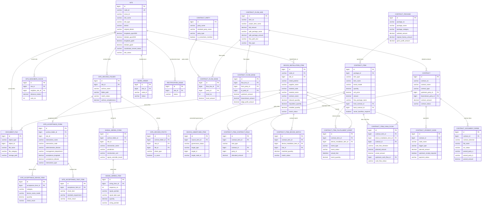

## 2. ER 总览

```mermaid
erDiagram
    SITE ||--o{ DEVICE_INSTALLATION_ITEM : "NodeID/site_id"
    SITE ||--o{ SITE_NEIGHBOR_CACHE : "current site"
    SITE ||--o{ DOCUMENT_FILE : "archive files"
    SITE ||--o{ SITE_ARCHIVE_FOLDER : "archive folder"
    SITE_ARCHIVE_FOLDER ||--o| SITE_ACCEPTANCE_FORM : "acceptance docx"
    SITE_ACCEPTANCE_FORM ||--o{ SITE_ACCEPTANCE_DEVICE_ITEM : "device check"
    SITE_ACCEPTANCE_FORM ||--o{ SITE_ACCEPTANCE_TEST_ITEM : "function test"
    SITE_ARCHIVE_FOLDER ||--o| SIGNAL_WIRING_FORM : "wiring xls"
    SIGNAL_WIRING_FORM ||--o{ SIGNAL_WIRING_ITEM : "wiring item"
    SITE_ARCHIVE_FOLDER ||--o{ SITE_ARCHIVE_PHOTO : "photos"
    DEVICE_INSTALLATION_ITEM ||--o{ DOCUMENT_FILE : "device files"
    DEVICE_INSTALLATION_ITEM ||--o| DEVICE_UNMATCHED_ITEM : "unmatched governance"
    SITE ||--o{ WORK_ORDER : "maintenance"
    SITE ||--o{ RECTIFICATION_ISSUE : "construction issue"
    CONTRACT_PARTY ||--o{ CONTRACT_FLOW_NODE : "party nodes"
    CONTRACT_FLOW_LINE ||--o{ CONTRACT_FLOW_NODE : "flow nodes"
    CONTRACT_FLOW_LINE ||--o{ CONTRACT_FLOW_EDGE : "flow edges"
    CONTRACT_PACKAGE ||--o{ CONTRACT_ITEM : "quote items"
    CONTRACT_ITEM ||--o{ CONTRACT_ITEM_CONTRACT_ROLE : "party roles"
    CONTRACT_ITEM ||--o{ CONTRACT_ITEM_DEVICE_MATCH : "device match"
    CONTRACT_ITEM ||--o{ CONTRACT_ITEM_FULFILLMENT_EVENT : "device events"
    CONTRACT_ITEM ||--o{ CONTRACT_ITEM_CASH_FLOW : "item cash flow"
    DEVICE_INSTALLATION_ITEM ||--o{ CONTRACT_ITEM_DEVICE_MATCH : "contract match"
    DEVICE_INSTALLATION_ITEM ||--o{ CONTRACT_ITEM_FULFILLMENT_EVENT : "events"
    DEVICE_INSTALLATION_ITEM ||--o{ CONTRACT_ITEM_CASH_FLOW : "cash flow"
    CONTRACT ||--o{ CONTRACT_PAYMENT_NODE : "payments"
    CONTRACT ||--o{ CONTRACT_DOCUMENT_PARSE : "contract docs"
    CONTRACT_FLOW_LINE ||--o{ CONTRACT : "related contracts"
    CONTRACT ||--o{ CONTRACT_ITEM_CONTRACT_ROLE : "front/back role"

    SITE {
        bigint id PK
        varchar node_id UK
        varchar cross_id
        varchar site_name
        varchar site_type
        varchar district
        varchar original_district
        decimal longitude_cgcs2000
        decimal latitude_cgcs2000
        decimal longitude_gcj02
        decimal latitude_gcj02
        varchar coordinate_convert_status
        varchar site_status
    }

    DEVICE_INSTALLATION_ITEM {
        bigint id PK
        varchar node_id FK
        bigint site_id FK
        varchar install_position
        varchar supplier_name
        varchar material_code
        varchar material_name
        varchar contract_name
        decimal inbound_quantity
        decimal requisition_quantity
        decimal installed_quantity
        varchar match_status
    }

    DEVICE_UNMATCHED_ITEM {
        bigint id PK
        bigint source_item_id FK
        varchar governance_status
        varchar target_type
        bigint target_id
        varchar target_node_id
    }

    SITE_NEIGHBOR_CACHE {
        bigint id PK
        bigint site_id FK
        bigint neighbor_site_id FK
        decimal distance_meters
        int rank_no
    }

    SITE_ARCHIVE_FOLDER {
        bigint id PK
        bigint site_id FK
        varchar archive_name
        varchar folder_path
        varchar match_status
        decimal archive_completeness
    }

    SITE_ACCEPTANCE_FORM {
        bigint id PK
        bigint archive_folder_id FK
        bigint site_id FK
        varchar intersection_name
        varchar intersection_code
        varchar administrative_division
        varchar management_department
        decimal acceptance_longitude
        decimal acceptance_latitude
        varchar intersection_type
    }

    SITE_ACCEPTANCE_DEVICE_ITEM {
        bigint id PK
        bigint acceptance_form_id FK
        varchar category
        varchar device_name_model
        decimal quantity
        varchar check_result
    }

    SITE_ACCEPTANCE_TEST_ITEM {
        bigint id PK
        bigint acceptance_form_id FK
        varchar check_item
        varchar standard_requirement
        varchar check_result
    }

    SIGNAL_WIRING_FORM {
        bigint id PK
        bigint archive_folder_id FK
        bigint site_id FK
        varchar intersection_name
        varchar jurisdiction
        varchar construction_unit
        varchar signal_controller_brand
    }

    SIGNAL_WIRING_ITEM {
        bigint id PK
        bigint wiring_form_id FK
        int sequence_no
        varchar signal_position
        varchar signal_light_type
        decimal quantity
        varchar wiring_position
    }

    SITE_ARCHIVE_PHOTO {
        bigint id PK
        bigint archive_folder_id FK
        bigint site_id FK
        bigint file_id FK
        varchar photo_type
        boolean is_cover
    }

    DOCUMENT_FILE {
        bigint id PK
        varchar object_type
        bigint object_id
        varchar file_name
        varchar file_category
        varchar storage_path
    }

    WORK_ORDER {
        bigint id PK
        bigint site_id FK
        varchar node_id
        varchar status
    }

    RECTIFICATION_ISSUE {
        bigint id PK
        bigint site_id FK
        varchar status
    }

    CONTRACT_PARTY {
        bigint id PK
        varchar party_name
        varchar standard_party_name
        varchar party_type
        boolean is_consortium_member
    }

    CONTRACT_FLOW_LINE {
        bigint id PK
        varchar item_no
        varchar project_item_name
        decimal bid_amount
        varchar split_package_name
        decimal split_package_amount
        varchar flow_path_text
        varchar flow_type
    }

    CONTRACT_FLOW_NODE {
        bigint id PK
        bigint flow_line_id FK
        bigint party_id FK
        int level_no
        decimal level_amount
    }

    CONTRACT_FLOW_EDGE {
        bigint id PK
        bigint flow_line_id FK
        bigint from_party_id FK
        bigint to_party_id FK
        decimal upstream_amount
        decimal downstream_amount
        decimal edge_profit_amount
    }

    CONTRACT_PACKAGE {
        bigint id PK
        varchar package_no
        varchar package_name
        varchar package_category
        decimal subtotal_amount
        decimal original_factory_amount
        decimal gross_profit_amount
    }

    CONTRACT_ITEM {
        bigint id PK
        bigint package_id FK
        varchar item_type
        varchar item_name
        varchar brand_model
        decimal quantity
        decimal unit_price
        decimal amount
        varchar flow_package_name
        bigint front_contract_id FK
        bigint back_contract_id FK
        boolean owner_backflow_required
    }

    CONTRACT_ITEM_CONTRACT_ROLE {
        bigint id PK
        bigint contract_item_id FK
        varchar role_type
        bigint contract_id FK
        bigint party_id FK
        decimal allocated_amount
    }

    CONTRACT_ITEM_DEVICE_MATCH {
        bigint id PK
        bigint contract_item_id FK
        bigint device_installation_item_id FK
        bigint site_id FK
        decimal matched_quantity
        varchar match_status
    }

    CONTRACT {
        bigint id PK
        varchar contract_no
        varchar contract_name
        varchar contract_type
        bigint upstream_party_id FK
        bigint downstream_party_id FK
        decimal contract_amount
        varchar contract_status
    }

    CONTRACT_PAYMENT_NODE {
        bigint id PK
        bigint contract_id FK
        varchar node_name
        varchar trigger_type
        decimal planned_amount
        boolean upstream_receipt_required
        varchar payment_status
    }

    CONTRACT_DOCUMENT_PARSE {
        bigint id PK
        bigint contract_id FK
        varchar contract_direction
        varchar file_name
        varchar ocr_status
        varchar parsed_party_a
        varchar parsed_party_b
        decimal parsed_amount
    }

    CONTRACT_ITEM_FULFILLMENT_EVENT {
        bigint id PK
        bigint contract_item_id FK
        bigint device_installation_item_id FK
        varchar event_type
        varchar event_status
        datetime actual_time
        decimal event_quantity
    }

    CONTRACT_ITEM_CASH_FLOW {
        bigint id PK
        bigint contract_item_id FK
        bigint device_installation_item_id FK
        bigint contract_id FK
        varchar cash_flow_direction
        decimal planned_amount
        decimal actual_amount
        bigint upstream_cash_flow_id FK
        varchar cash_flow_status
    }
```
