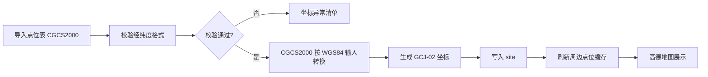

## 5. 坐标转换数据流

```mermaid
flowchart LR
    A["导入点位表 CGCS2000"] --> B["校验经纬度格式"]
    B --> C{"校验通过?"}
    C -- "否" --> D["坐标异常清单"]
    C -- "是" --> E["CGCS2000 按 WGS84 输入转换"]
    E --> F["生成 GCJ-02 坐标"]
    F --> G["写入 site"]
    G --> H["刷新周边点位缓存"]
    H --> I["高德地图展示"]
```
